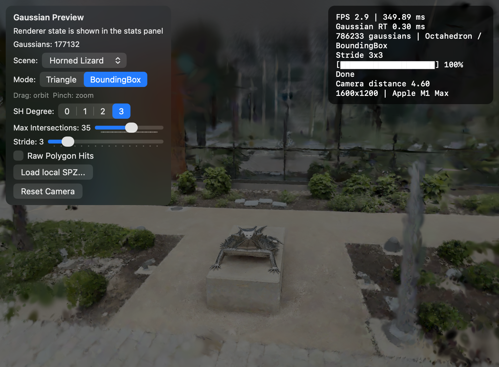

# Metal 3D Gaussian Ray Tracing (3DGRT)

A Metal 3 implementation of **3D Gaussian Ray Tracing (3DGRT)**, referencing the original research and CUDA implementation by NVIDIA ([3dgrut](https://github.com/nv-tlabs/3dgrut)).

This project demonstrates how to implement the core principles of 3DGRT using Apple's modern Ray Tracing APIs, enabling real-time, high-quality rendering of Gaussian Splats on macOS and iOS.

## Key Features

- **Metal 3 Ray Tracing Acceleration**: Leverages `MTLAccelerationStructure` and `intersection_query` for hardware-accelerated traversal.
- **Enclosing Primitives (Proxy Meshes)**: Implements 3DGRT's broad-phase acceleration using various proxy geometries:
  - Icosahedron / Octahedron / Tetrahedron
  - Tri-Hexahedron
  - Tri-Surfels (Min-Axis Optimized)
- **Hybrid Rendering Pipeline**:
  - **Broad-phase**: Hardware-accelerated intersection with proxy meshes.
  - **Narrow-phase**: Rigorous Gaussian intersection evaluation within a per-ray sorted queue.
- **View-Dependent Shading**: Support for high-degree Spherical Harmonics (SH) for accurate specular and view-dependent effects.
- **Modern File Formats**: Native support for:
  - `.spz` (Compressed Gaussian Splatting) – Powered by a modified version of [spz-swift](https://github.com/scier/spz-swift).
  - Standard Gaussian Splat point clouds
- **Cross-Platform**: Optimized for Apple Silicon (M-series and A-series chips), supporting both macOS and iOS/iPadOS.

## Architecture

The renderer follows the 3DGRT philosophy by decoupling the acceleration structure from the complex Gaussian mathematical model:

1. **Proxy Generation**: Gaussian splats are converted into optimized enclosing primitives (proxy meshes) via Metal compute shaders.
2. **Acceleration Structure**: These proxies are built into a high-performance Bottom-Level Acceleration Structure (BLAS) using Metal's ray tracing APIs.
3. **Ray Traversal**: An `intersection_query` identifies candidate proxies.
4. **Hit Ranking & Composition**: For each ray, hits are collected into a fixed-size sorted queue (e.g., top 16 hits). The final color is computed by compositing these hits using exact Gaussian math and volumetric integration.

## Getting Started

### Prerequisites

- Xcode 15+
- macOS 14+ or iOS 17+
- A device with an Apple Silicon chip (M1/A15 or later recommended)

### Building

1. Clone the repository.
2. Open `Metal3DGRT.xcodeproj` in Xcode.
3. Select your target (macOS or iOS).
4. Build and run (Cmd + R).

## Screenshots

## References

- **3DGRT (3D Gaussian Ray Tracing)**: NVIDIA Research ([GitHub](https://github.com/nv-tlabs/3dgrut))
- **spz-swift**: [GitHub](https://github.com/scier/spz-swift) (Modified for this implementation)
- **Metal Ray Tracing**: Apple Developer Documentation

## License

This project is released under the MIT License. See [LICENSE](LICENSE) for details.
